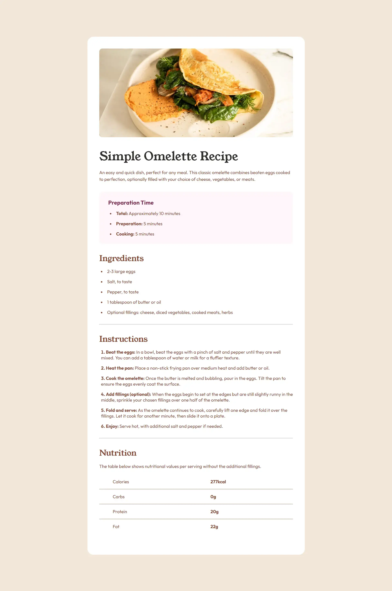
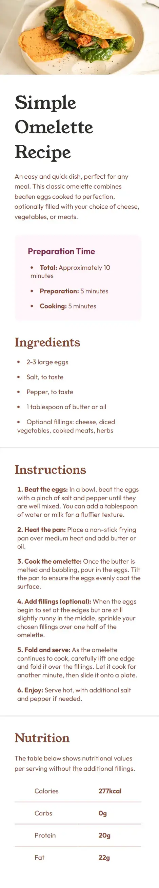

# Frontend Mentor - Recipe page solution

This is a solution to the [Recipe page challenge on Frontend Mentor](https://www.frontendmentor.io/challenges/recipe-page-KiTsR8QQKm). Frontend Mentor challenges help you improve your coding skills by building realistic projects.

## Table of contents

- [Overview](#overview)
  - [The challenge](#the-challenge)
  - [Screenshot](#screenshot)
  - [Links](#links)
- [My process](#my-process)
  - [Built with](#built-with)
  - [What I learned](#what-i-learned)
  - [Useful resources](#useful-resources)
- [Author](#author)
- [Acknowledgments](#acknowledgments)

**Note: Delete this note and update the table of contents based on what sections you keep.**

## Overview

### Screenshot

### Links

- Solution URL: [GitHub Repository](https://github.com/rckash/recipe-page)
- Live Site URL: [GitHub Page](https://rckash.github.io/recipe-page)

## My process

### Built with

- Semantic HTML5 markup
- CSS custom properties
- Flexbox

### What I learned

In this project I have learned how to use media query to make my design responsive for different screen widths.

### Useful resources

- [Master Media Queries And Responsive CSS Web Design Like a Chameleon!](https://www.youtube.com/watch?v=K24lUqcT0Ms) - This helped me get started with using media queries to make my website responsive to different screen widths. Slaying The Dragon carefully explained when a web page should apply media queries to make the content fit best.

## Author

- Website - [Rirrucham Kashyap](https://github.com/rckash)
- Frontend Mentor - [@rckash](https://www.frontendmentor.io/profile/rckash)

## Acknowledgments

I would like to tip my hat to the YouTube channel [Slaying The Dragon](https://www.youtube.com/@slayingthedragon) for helping me learn about media query.
